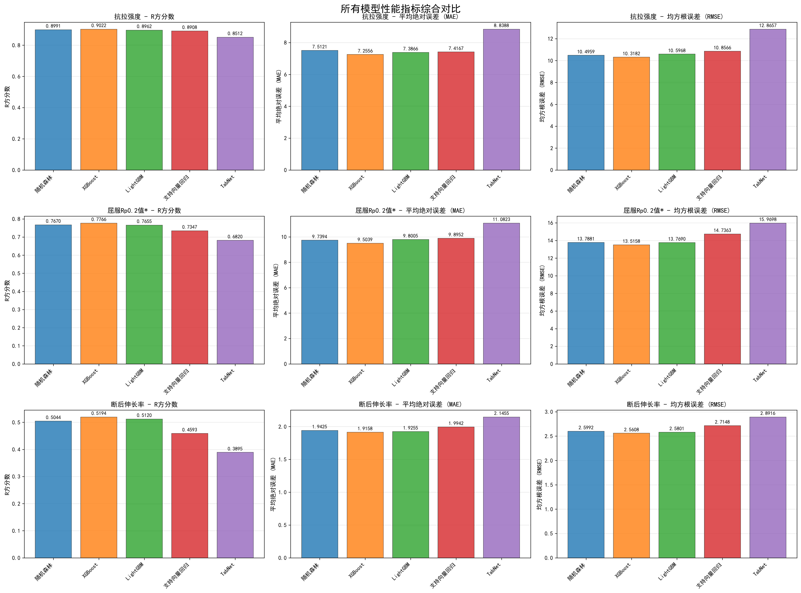
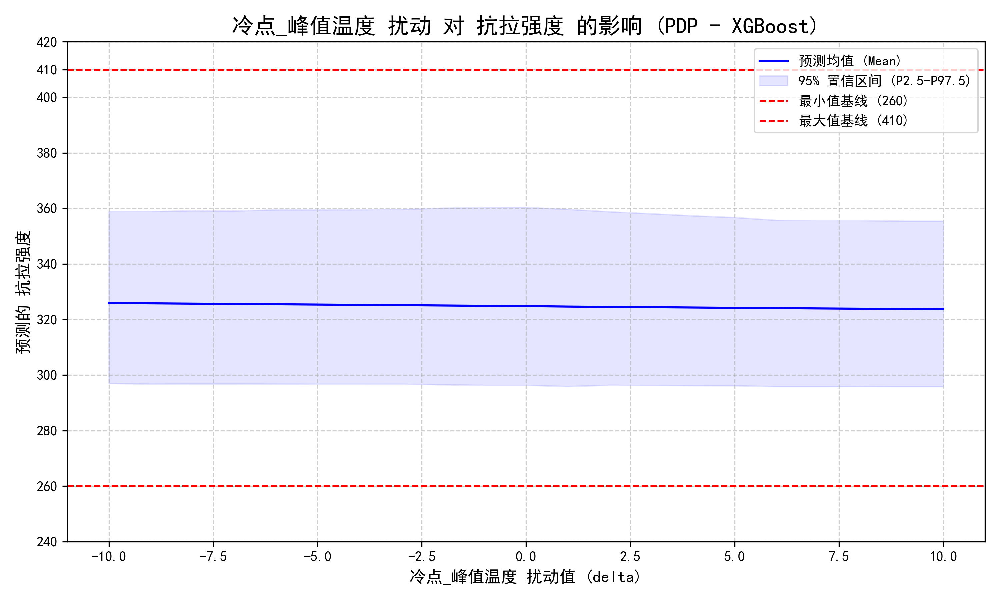
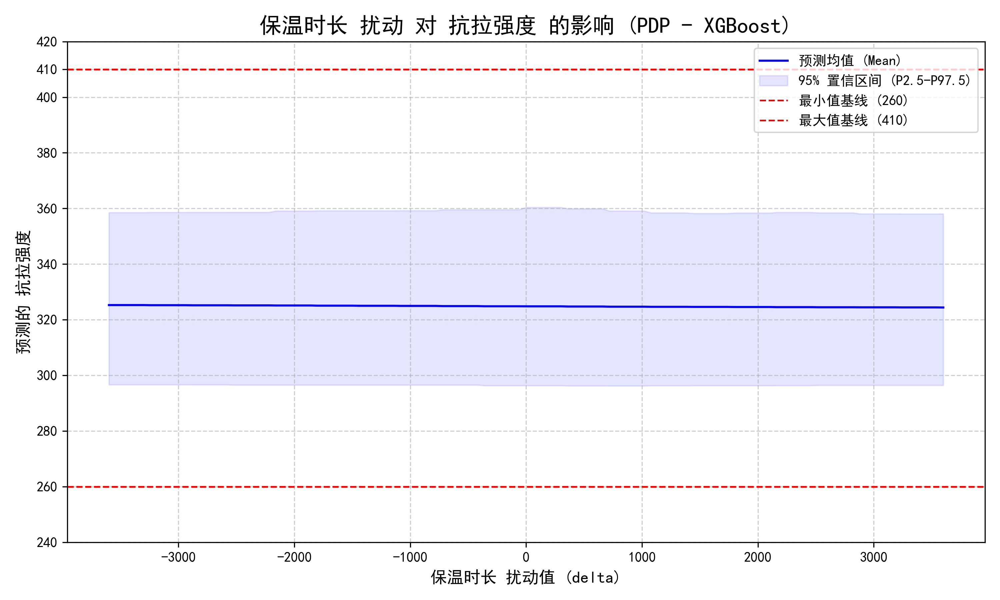

# 钢卷性能预测项目

## 项目概述

本项目围绕钢卷热处理与性能评估，提供从数据读取、预处理、建模训练、扰动分析到结果可视化的一整套流程。通过多种机器学习算法对钢卷性能指标进行预测建模，并分析关键工艺参数对性能的影响。

## 模块结构与职责

- **`01_read_data/`**：数据读取、清洗、合并与EDA；生成特征筛选结果与扰动数据集
  - 详见 [01_read_data/README.md](01_read_data/README.md)
- **`02_frost_model/`**：基于随机森林、XGBoost、LightGBM的集成学习模型训练、调参与扰动预测
  - 详见 [02_frost_model/README.md](02_frost_model/README.md)
- **`03_nonlinear_model/`**：基于SVR的非线性回归建模与扰动预测
  - 详见 [03_nonlinear_model/README.md](03_nonlinear_model/README.md)
- **`04_neural_network/`**：基于TabNet的深度模型训练与扰动预测
  - 详见 [04_neural_network/README.md](04_neural_network/README.md)
- **`05_result_plot/`**：汇总并对比模型回归指标、特征重要性等可视化结果
  - 详见 [05_result_plot/README.md](05_result_plot/README.md)

## 快速开始

1. **数据准备**：运行 `01_read_data` 模块，生成最终数据集和扰动数据集
2. **模型训练**：运行 `02_frost_model`、`03_nonlinear_model`、`04_neural_network` 模块，训练各类型模型
3. **结果可视化**：运行 `05_result_plot` 模块，生成汇总对比图表

## 数据流程

| 步骤 | 输入数据量 | 输出数据量 | 主要操作 |
|------|------------|------------|----------|
| 原始数据 | 12,737个钢卷 | 12,737个钢卷 | 数据清洗和格式统一 |
| 特征提取 | 12,737个钢卷 | 3,250条工艺记录 | 去重处理，保留唯一工艺记录 |
| 数据合并 | 3,250条工艺记录 | 2,760行有效数据 | 合并性能数据，清洗无效数据 |
| 特征选择 | 2,760行，82列 | 2,760行，39列 | 删除43个冗余特征 |
| 扰动生成 | 2,760行，39列 | 449,880个扰动样本 | 生成敏感性分析数据 |

## 模型性能对比

### 各模型R²分数对比

| 模型 | 抗拉强度 | 屈服Rp0.2值* | 断后伸长率 |
|------|----------|--------------|------------|
| 随机森林 | 0.8991 | 0.7670 | 0.5044 |
| XGBoost | 0.9022 | 0.7766 | 0.5194 |
| LightGBM | 0.8962 | 0.7655 | 0.5120 |
| SVR | 0.8908 | 0.7347 | 0.4593 |
| TabNet | 0.8512 | 0.6820 | 0.3895 |

**最佳表现**：
- 抗拉强度：XGBoost (R²=0.9022)
- 屈服Rp0.2值*：XGBoost (R²=0.7766)  
- 断后伸长率：XGBoost (R²=0.5194)

## 结果展示

### 模型性能对比

### 特征重要性分析

### 扰动预测结果

## 技术特点

### 数据处理
- **多源数据融合**：整合温度曲线、化学成分、性能指标等多维度数据
- **特征工程**：从时间序列中提取35个工艺特征
- **数据清洗**：自动处理缺失值、异常值和重复数据

### 建模方法
- **集成学习**：随机森林、XGBoost、LightGBM
- **非线性模型**：支持向量回归(SVR)
- **深度学习**：TabNet神经网络
- **超参数调优**：使用贝叶斯优化和随机搜索

### 模型解释
- **特征重要性**：多种方法计算特征重要性
- **扰动分析**：PDP效应图分析关键参数影响
- **置信区间**：提供预测不确定性估计

## 依赖与环境

- **Python 3.9+**
- **主要依赖**：
  - 数据处理：pandas、numpy
  - 机器学习：scikit-learn、xgboost、lightgbm
  - 深度学习：pytorch、pytorch-tabnet
  - 可视化：matplotlib、seaborn
  - 优化：optuna、scikit-optimize

## 注意事项

- 请按照模块顺序依次运行各脚本
- 确保有足够的磁盘空间存储模型文件和结果
- 深度学习模块建议使用GPU加速训练
- 所有模型都设置了随机种子确保结果可复现
- 详细的使用说明请参考各模块的README文件

