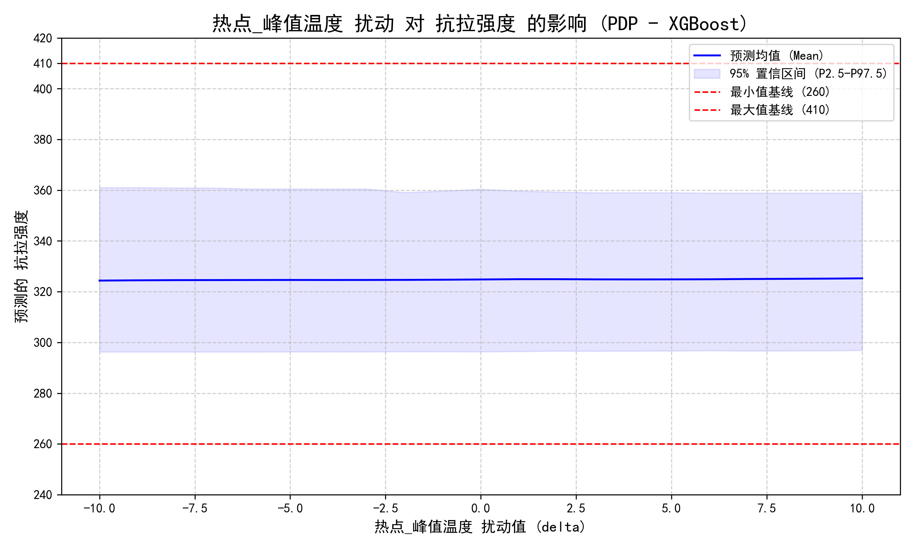

## 钢卷性能预测项目（总体说明）

本项目围绕钢卷热处理与性能评估，提供从数据读取、预处理、建模训练、扰动分析到结果可视化的一整套流程。各子模块均提供独立的 README，说明输入/输出与复现步骤。

### 模块结构与职责
- `01_read_data/`：数据读取、清洗、合并与EDA；生成特征筛选结果与扰动数据集。
  - 详见 `01_read_data/README.md`。
- `02_frost_model/`：基于随机森林、XGBoost、LightGBM 的树模型训练、调参与扰动预测。
  - 详见 `02_frost_model/README.md`。
- `03_nonlinear_model/`：基于 GPR、SVR 的非线性回归建模与扰动预测。
  - 详见 `03_nonlinear_model/README.md`。
- `04_neural_network/`：基于 TabNet 的深度模型训练与扰动预测（ICE/PDP）。
  - 详见 `04_neural_network/README.md`。
- `05_result_plot/`：汇总并对比模型回归指标、特征重要性等可视化结果。
  - 详见 `05_result_plot/README.md`。

### 快速开始
1. 依次运行 `01_read_data` → `02_frost_model`/`03_nonlinear_model`/`04_neural_network`，生成各自的 `results` 与指标汇总。
2. 进入 `05_result_plot` 运行绘图脚本，得到汇总对比图。

### 结果展示
各模块运行完成后会生成详细的结果文件，包括：
- 模型性能指标对比
- 特征重要性分析
- 扰动预测PDP效应图
- 超参数搜索记录

#### 模型性能对比示例

#### 特征重要性对比

#### 扰动预测结果示例

> 注：除05模块的关键图片外，其余中间产物与大文件均被 `.gitignore` 忽略，以减小仓库体积并保护原始数据。

### 依赖与环境
- Python 3.9+
- 主要依赖：pandas、numpy、scikit-learn、matplotlib、xgboost、lightgbm、scikit-optimize、pytorch-tabnet 等。
- 详见各子模块 README 中的具体安装与运行说明。

